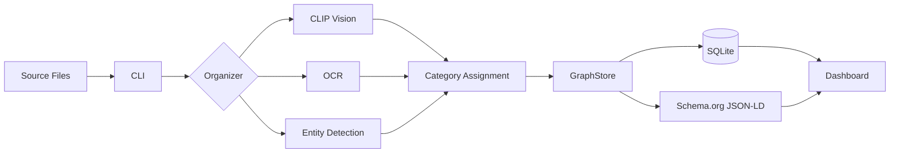

# Schema.org File Organization System

AI-powered file organization using CLIP vision, OCR, Schema.org metadata, and entity detection.

**Version:** 1.4.0 | **Python:** 3.8 - 3.14 | **Files Processed:** 265,000+

## Quick Start

```bash
# Setup
git clone https://github.com/aledlie/schema-org-file-system.git
cd schema-org-file-system
python3 -m venv venv && source venv/bin/activate
pip install -e ".[all]"
brew install tesseract poppler

# Run
organize-files content --source ~/Downloads --dry-run --limit 100
organize-files health  # Check dependencies
```

## CLI Commands

| Command | Description |
|---------|-------------|
| `organize-files content` | AI-powered organization (CLIP, OCR) |
| `organize-files name` | Filename pattern organization |
| `organize-files type` | Extension-based organization |
| `organize-files health` | Check system dependencies |
| `organize-files migrate-ids` | Run database migration |
| `organize-files update-site` | Update dashboard data |

## Architecture



## Classification Priority

1. **Organization** - client, vendor, invoice, company names
2. **Person** - resume, contact, signatures (OCR-enhanced)
3. **Legal/Contract** - contracts, agreements, terms
4. **E-commerce** - product listings, shopping carts
5. **Software UI** - app interfaces, dashboards
6. **Game Assets** - 200+ patterns, sprites, textures, audio
7. **Filepath** - directory structure patterns
8. **Content Analysis** - OCR text + CLIP vision
9. **MIME Type** - file extension fallback

## Project Structure

```
├── src/                    # Core library
│   ├── cli.py              # CLI entry point
│   ├── generators.py       # Schema.org generators
│   └── storage/            # GraphStore, models
├── scripts/                # Organizer scripts
├── tests/                  # Unit, integration, e2e
├── _site/                  # Web dashboard
└── results/                # Database & reports
```

## Output Folders

```
~/Documents/
├── Organization/{Company}/    # Vendor/partner files
├── Person/{Name}/             # Person-related files
├── GameAssets/                # Sprites, textures, models
├── Financial/                 # Invoices, receipts
├── Technical/                 # Code, configs
└── Media/                     # Photos, videos, audio
```

## Key Features

- **Entity Detection** - Prioritizes Organization and Person identification
- **Canonical IDs** - UUID v5 + SHA256 for persistent identification
- **Schema.org Metadata** - Full JSON-LD generation
- **Cost Tracking** - ROI calculation with manual time savings
- **E2E Testing** - Playwright with OpenTelemetry instrumentation

## Tech Stack

| Layer | Technology |
|-------|------------|
| AI/ML | PyTorch, CLIP, OpenCV |
| OCR | Tesseract |
| Database | SQLite + SQLAlchemy |
| Monitoring | Sentry SDK |
| Testing | pytest, Playwright |

## Documentation

- [CHANGELOG](docs/CHANGELOG.md) - Version history
- [DEPENDENCIES](docs/DEPENDENCIES.md) - Installation guide
- [ARCHITECTURE_REFACTOR](docs/ARCHITECTURE_REFACTOR.md) - Design decisions

## Environment Variables

| Variable | Description |
|----------|-------------|
| `FILE_SYSTEM_SENTRY_DSN` | Sentry error tracking (Doppler) |
| `--sentry-dsn` | CLI override |

## Troubleshooting

| Issue | Solution |
|-------|----------|
| HEIC fails | `pip install pillow-heif` |
| No OCR | `brew install tesseract` |
| No AI | `pip install torch transformers` |
| Check deps | `organize-files health` |
