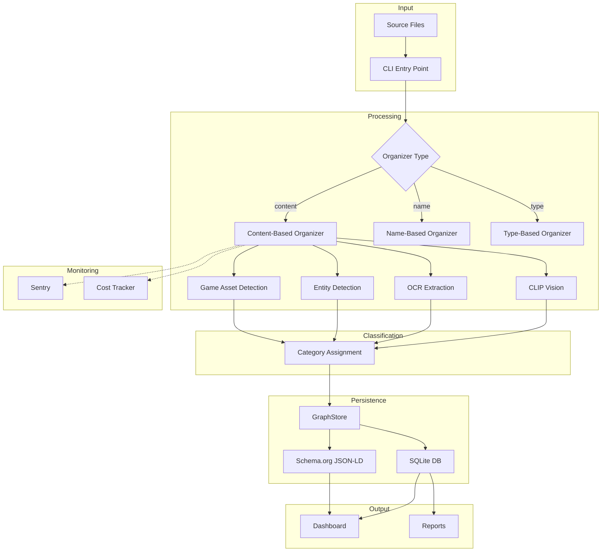
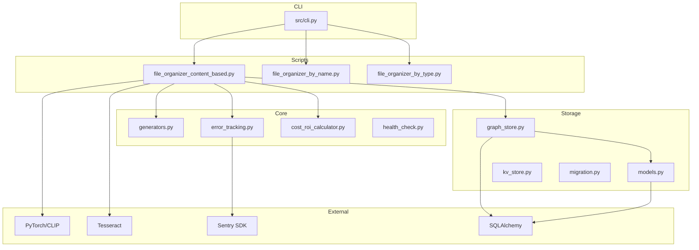

# Schema.org File Organization System - Codebase Analysis

**Generated:** 2026-02-01
**Version:** 1.4.0
**Python:** 3.8 - 3.14

---

## 1. Project Overview

### Type
AI-powered file organization CLI application with web dashboard visualization.

### Primary Purpose
Automatically organize files using AI content analysis (CLIP vision model, OCR), rule-based classification, and generate Schema.org JSON-LD metadata for semantic file management.

### Tech Stack
| Layer | Technology |
|-------|------------|
| Language | Python 3.8+ |
| AI/ML | PyTorch, Transformers (CLIP), OpenCV |
| OCR | Tesseract (pytesseract) |
| Database | SQLite with SQLAlchemy ORM |
| Visualization | GitHub Pages (HTML/CSS/JS) |
| Error Tracking | Sentry SDK v2 |
| Package Manager | pip, pyproject.toml |

### Architecture Pattern
**Layered Architecture** with clear separation:
```
CLI Layer (src/cli.py)
    ↓
Script Layer (scripts/*.py)
    ↓
Core Library (src/*.py)
    ↓
Storage Layer (src/storage/*.py)
    ↓
Database (SQLite)
```

### Key Metrics
| Metric | Value |
|--------|-------|
| Files Processed | 265,000+ |
| Success Rate | 98.6% |
| Top Category | GameAssets (84.8%) |
| Source Files | 41+ Python files |
| Test Files | 20+ test modules |

---

## 2. Directory Structure Analysis

```
schema-org-file-system/
├── src/                          # Core library (18 Python modules)
│   ├── cli.py                    # Unified CLI entry point
│   ├── generators.py             # Schema.org type generators
│   ├── error_tracking.py         # Sentry integration
│   ├── cost_roi_calculator.py    # Cost/ROI metrics
│   ├── health_check.py           # Dependency validation
│   ├── validator.py              # Schema validation
│   ├── integration.py            # External service integration
│   ├── base.py                   # Base classes
│   ├── enrichment.py             # Metadata enrichment
│   ├── uri_utils.py              # URI/IRI generation utilities
│   ├── api/
│   │   └── timeline_api.py       # Timeline data API
│   └── storage/
│       ├── __init__.py           # Storage package init
│       ├── models.py             # SQLAlchemy models (12 models)
│       ├── graph_store.py        # Graph operations (~1150 lines)
│       ├── kv_store.py           # Key-value storage
│       └── migration.py          # Database migrations
│
├── scripts/                      # Executable scripts (23 files)
│   ├── file_organizer_content_based.py  # Main AI organizer
│   ├── file_organizer_by_name.py        # Name-based organizer
│   ├── file_organizer_by_type.py        # Extension-based organizer
│   ├── image_content_renamer.py         # CLIP-based image renaming
│   ├── image_content_analyzer.py        # Image content analysis
│   ├── correction_feedback.py           # User correction system
│   ├── data_preprocessing.py            # ML training prep
│   ├── evaluate_model.py                # Model evaluation
│   ├── migrate_ids.py                   # ID migration
│   ├── regenerate_schemas.py            # Schema regeneration
│   ├── generate_timeline_data.py        # Timeline visualization
│   ├── update_site_data.py              # Dashboard data updates
│   ├── run_with_sentry.sh               # Sentry wrapper script
│   └── ...                              # Other utilities
│
├── tests/                        # Test suite
│   ├── conftest.py               # Pytest fixtures
│   ├── unit/                     # Unit tests
│   ├── integration/              # Integration tests
│   ├── e2e/                      # E2E tests (Playwright + OpenTelemetry)
│   └── fixtures/                 # Test data fixtures
│
├── _site/                        # Dashboard UI (GitHub Pages)
│   ├── index.html                # Main dashboard
│   ├── metadata_viewer.html      # Metadata browser
│   ├── timeline.html             # Timeline visualization
│   ├── metadata.json             # Generated metadata
│   └── timeline_data.json        # Timeline data
│
├── results/                      # Output directory
│   ├── file_organization.db      # SQLite database
│   └── *.json                    # Reports and exports
│
├── docs/                         # Documentation
├── pyproject.toml                # Package configuration
├── requirements.txt              # Dependencies
└── CLAUDE.md                     # Project instructions
```

### Directory Purposes

| Directory | Purpose | Key Files |
|-----------|---------|-----------|
| `src/` | Core library modules | cli.py, generators.py, storage/ |
| `scripts/` | Executable entry points | file_organizer_*.py |
| `tests/` | Test suite | conftest.py, unit/, integration/ |
| `_site/` | Web dashboard | index.html, *.json |
| `results/` | Database and reports | file_organization.db |
| `docs/` | Documentation | DEPENDENCIES.md |

---

## 3. File-by-File Breakdown

### Core Library (`src/`)

#### `src/cli.py` (282 lines)
**Purpose:** Unified CLI entry point with subcommands.

**Key Functions:**
- `main()` - argparse-based CLI with subcommands
- `cmd_content()` - AI-powered organization
- `cmd_name()` - Name-based organization
- `cmd_type()` - Extension-based organization
- `cmd_migrate()` - Database migration
- `cmd_health()` - Dependency check

**Subcommands:**
| Command | Description |
|---------|-------------|
| `organize-files content` | AI-powered (CLIP, OCR) |
| `organize-files name` | Filename patterns |
| `organize-files type` | File extensions |
| `organize-files health` | Check dependencies |
| `organize-files migrate-ids` | Run migrations |
| `organize-files preprocess` | Prepare ML data |
| `organize-files evaluate` | Model evaluation |
| `organize-files update-site` | Update dashboard |
| `organize-files timeline` | Generate timeline |

---

#### `src/generators.py` (~1715 lines)
**Purpose:** Schema.org type generators for metadata creation.

**Classes:**
| Class | Schema.org Type | Description |
|-------|-----------------|-------------|
| `DocumentGenerator` | Document, DigitalDocument | Office docs, PDFs |
| `ImageGenerator` | ImageObject | Photos, images |
| `VideoGenerator` | VideoObject | Video files |
| `AudioGenerator` | AudioObject | Audio files |
| `CodeGenerator` | SoftwareSourceCode | Source code |
| `DatasetGenerator` | Dataset | Data files |
| `ArchiveGenerator` | CreativeWork | ZIP, archives |
| `OrganizationGenerator` | Organization | Companies |
| `PersonGenerator` | Person | Individuals |

**Design Pattern:** Method chaining (fluent interface)
```python
generator = ImageGenerator()
schema = (generator
    .set_name("photo.jpg")
    .set_content_url("/path/to/photo.jpg")
    .set_encoding_format("image/jpeg")
    .set_width(1920)
    .set_height(1080)
    .build())
```

---

#### `src/storage/models.py` (865 lines)
**Purpose:** SQLAlchemy ORM models for graph-based storage.

**Entity Models:**
| Model | Description | ID Strategy |
|-------|-------------|-------------|
| `File` | Central file node | SHA-256 of path |
| `Category` | Classification categories | UUID v5 from name |
| `Company` | Detected organizations | UUID v5 from name |
| `Person` | Detected individuals | UUID v5 from name |
| `Location` | Geographic locations | UUID v5 from name |
| `FileRelationship` | File-to-file edges | Auto-increment |
| `OrganizationSession` | Processing session | UUID |
| `CostRecord` | Feature cost tracking | Auto-increment |
| `SchemaMetadata` | JSON-LD storage | Auto-increment |
| `KeyValueStore` | Flexible KV storage | Auto-increment |
| `MergeEvent` | Entity merge audit | UUID |

**Enums:**
```python
class FileStatus(Enum):
    PENDING = "pending"
    ORGANIZED = "organized"
    SKIPPED = "skipped"
    ERROR = "error"
    ALREADY_ORGANIZED = "already_organized"

class RelationshipType(Enum):
    DUPLICATE = "duplicate"
    SIMILAR = "similar"
    VERSION = "version"
    DERIVED = "derived"
    RELATED = "related"
    PARENT_CHILD = "parent_child"
    REFERENCES = "references"
```

**Association Tables:**
- `file_categories` - Files ↔ Categories (with confidence)
- `file_companies` - Files ↔ Companies (with context)
- `file_people` - Files ↔ People (with role)
- `file_locations` - Files ↔ Locations (with type)

---

#### `src/storage/graph_store.py` (~1150 lines)
**Purpose:** High-level graph operations on SQLAlchemy models.

**Key Methods:**
| Method | Description |
|--------|-------------|
| `add_file()` | Insert file with deduplication |
| `get_file()` | Retrieve by ID or path |
| `get_files()` | Query with filters |
| `add_file_to_category()` | Link file to category |
| `add_file_to_company()` | Link file to company |
| `add_file_to_person()` | Link file to person |
| `add_relationship()` | Create file-file edge |
| `find_related_files()` | BFS graph traversal |
| `find_duplicates()` | Find by content hash |
| `get_statistics()` | Aggregate stats |
| `search_files()` | Full-text search |

**Performance Optimizations:**
- SQLite WAL mode
- Connection pooling
- Batch operations
- Index-based queries

---

#### `src/error_tracking.py` (393 lines)
**Purpose:** Sentry SDK v2 integration for error tracking.

**Key Components:**
```python
# Initialization
init_sentry(dsn=None, environment=None, traces_sample_rate=0.1)

# Error capture
capture_error(error, level, context, tags, user_id)
capture_warning(message, context, tags)

# Performance tracking
@track_error('operation_name')
def my_function(): ...

with track_operation('classify_image', file_path=path):
    result = classifier.classify(image)
```

**Classes:**
| Class | Purpose |
|-------|---------|
| `ErrorLevel` | Severity constants (FATAL, ERROR, WARNING, INFO, DEBUG) |
| `FileProcessingErrorTracker` | Batch file processing tracker |

---

#### `src/cost_roi_calculator.py` (825 lines)
**Purpose:** Feature cost tracking and ROI calculation.

**Cost Types:**
```python
class CostType(Enum):
    COMPUTE = "compute"    # CPU/GPU time
    API_CALL = "api_call"  # External APIs
    STORAGE = "storage"    # File storage
    MEMORY = "memory"      # RAM usage
```

**Default Cost Configs:**
| Feature | Cost/Unit | Avg Time | Manual Time Saved |
|---------|-----------|----------|-------------------|
| `clip_vision` | $0.0001 | 2.5s | 30s |
| `tesseract_ocr` | $0.00001 | 1.5s | 60s |
| `face_detection` | $0.000005 | 0.5s | 5s |
| `nominatim_geocoding` | $0.00 | 1.0s | 120s |
| `keyword_classifier` | $0.00 | 0.001s | 15s |
| `pdf_extraction` | $0.00005 | 3.0s | 120s |
| `schema_generation` | $0.00 | 0.05s | 300s |
| `game_asset_detection` | $0.00 | 0.001s | 20s |

**ROI Calculation:**
```
ROI = (Value Generated - Cost) / Cost × 100%
Value = (Manual Time Saved × Files Classified) × Hourly Rate ($25/hr)
```

---

### Scripts (`scripts/`)

#### `scripts/file_organizer_content_based.py` (Main AI Organizer)
**Purpose:** Primary file organization using CLIP vision and OCR.

**Features:**
- CLIP model for image classification
- Tesseract OCR for text extraction
- Game asset detection (200+ patterns)
- Entity detection (Organization, Person)
- Schema.org JSON-LD generation
- GraphStore persistence
- Cost tracking integration
- Sentry error tracking

**Classification Priority:**
1. Organization Detection (keywords: client, vendor, invoice)
2. Person Detection (keywords: resume, contact, signatures, OCR-enhanced)
3. Legal/Contract Detection (contracts, agreements, terms)
4. E-commerce/Shopping Detection (product listings, carts)
5. Software UI Detection (app interfaces, dashboards)
6. Game Asset Detection (200+ patterns, numbered sprites, audio)
7. Filepath Matching (directory structure)
8. Content Analysis (OCR + CLIP)
9. MIME Type Fallback (extension)

**Additional Categories:**
- Marketing/Infographic - promotional content, data visualizations
- Docs/Documentation - technical docs, guides
- CRM/HR/Meeting Notes - business subcategories
- Source-based Photos - camera roll, screenshots by source

---

#### `scripts/data_preprocessing.py`
**Purpose:** Prepare training data for ML model improvement.

#### `scripts/evaluate_model.py`
**Purpose:** Evaluate classification model performance.

#### `scripts/correction_feedback.py`
**Purpose:** Record user corrections for learning.

#### `scripts/migrate_ids.py`
**Purpose:** Generate canonical IDs for existing records.

#### `scripts/regenerate_schemas.py`
**Purpose:** Rebuild Schema.org metadata.

#### `scripts/image_content_renamer.py`
**Purpose:** CLIP vision-based image renaming with category and description output.

#### `scripts/image_content_analyzer.py`
**Purpose:** Analyze images using CLIP to generate object IDs, categories, and descriptions.

---

### Tests (`tests/`)

#### E2E Tests (`tests/e2e/`)
**Purpose:** End-to-end testing with Playwright and OpenTelemetry instrumentation.

**Test Files:**
| File | Coverage |
|------|----------|
| `dashboard.spec.ts` | Main dashboard functionality |
| `timeline.spec.ts` | Timeline visualization |
| `metadata-viewer.spec.ts` | Metadata browser |
| `correction-interface.spec.ts` | User correction UI |

**Fixtures:**
- `otel-tracing.ts` - OpenTelemetry instrumentation
- `performance.ts` - Performance metrics collection
- `har-recording.ts` - Network traffic recording
- `traffic-tracking.ts` - Request tracking

---

#### `tests/conftest.py` (226 lines)
**Purpose:** Pytest fixtures and configuration.

**Fixtures:**
| Fixture | Description |
|---------|-------------|
| `temp_dir` | Temporary directory |
| `project_root` | Project root path |
| `fixtures_dir` | Test fixtures path |
| `sample_text_file` | Sample .txt file |
| `sample_json_file` | Sample .json file |
| `sample_image_file` | Minimal 1x1 PNG |
| `temp_db_path` | Temp database path |
| `graph_store` | GraphStore instance |
| `clean_db` | Fresh database |
| `mock_cost_calculator` | Mocked calculator |
| `mock_sentry` | Mocked Sentry |
| `sample_file_data` | Sample file dict |
| `sample_schema_data` | Sample Schema.org |

**Markers:**
- `@pytest.mark.slow` - Slow tests
- `@pytest.mark.integration` - Integration tests
- `@pytest.mark.e2e` - End-to-end tests

---

## 4. API Endpoints Analysis

This is a CLI application, not a REST API. However, there are internal "APIs":

### Internal Module APIs

#### GraphStore API (`src/storage/graph_store.py`)
```python
# File operations
store.add_file(file_data: dict) -> File
store.get_file(file_id: str) -> Optional[File]
store.get_files(status: FileStatus, limit: int) -> List[File]
store.update_file(file_id: str, updates: dict) -> bool

# Entity linking
store.add_file_to_category(file_id, category_name, confidence) -> bool
store.add_file_to_company(file_id, company_name, context) -> bool
store.add_file_to_person(file_id, person_name, role) -> bool

# Graph operations
store.add_relationship(source_id, target_id, rel_type, confidence) -> bool
store.find_related_files(file_id, max_depth=3) -> List[File]
store.find_duplicates(content_hash) -> List[File]

# Statistics
store.get_statistics() -> Dict[str, Any]
store.search_files(query, fields) -> List[File]
```

#### Schema Generator API (`src/generators.py`)
```python
# Builder pattern
generator = ImageGenerator()
schema = generator.set_name("photo.jpg")
                  .set_content_url("/path")
                  .set_width(1920)
                  .build()  # Returns JSON-LD dict
```

#### Cost Calculator API (`src/cost_roi_calculator.py`)
```python
# Recording usage
calc.record_usage(feature_name, processing_time, files_processed, success)

# Cost analysis
calc.calculate_feature_cost(feature_name) -> CostSummary
calc.calculate_roi(feature_name) -> ROIMetrics
calc.calculate_total_cost() -> dict
calc.calculate_total_roi() -> dict

# Context manager
with CostTracker(calc, 'clip_vision', files_processed=1):
    result = classify(image)
```

---

## 5. Architecture Deep Dive

### Data Flow



### Design Patterns

#### 1. Builder Pattern (Schema Generators)
```python
class ImageGenerator:
    def set_name(self, name):
        self._data['name'] = name
        return self  # Method chaining

    def build(self):
        return {"@context": "https://schema.org", **self._data}
```

#### 2. Repository Pattern (GraphStore)
```python
class GraphStore:
    def __init__(self, db_path):
        self.session = init_db(db_path)

    def add_file(self, data):
        # Abstracts SQLAlchemy details
        file = File(**data)
        self.session.add(file)
        self.session.commit()
```

#### 3. Factory Pattern (Organizer Selection)
```python
def get_organizer(organizer_type):
    if organizer_type == 'content':
        return ContentBasedFileOrganizer()
    elif organizer_type == 'name':
        return NameBasedOrganizer()
```

#### 4. Context Manager (Cost Tracking)
```python
class CostTracker:
    def __enter__(self):
        self.start_time = time.time()
        return self

    def __exit__(self, *args):
        elapsed = time.time() - self.start_time
        self.calculator.record_usage(...)
```

#### 5. Singleton (Error Tracker)
```python
_file_tracker: Optional[FileProcessingErrorTracker] = None

def get_file_tracker():
    global _file_tracker
    if _file_tracker is None:
        _file_tracker = FileProcessingErrorTracker()
    return _file_tracker
```

### Dependency Graph



---

## 6. Environment & Setup Analysis

### Requirements

#### Core Dependencies (`pyproject.toml`)
```toml
dependencies = [
    "Pillow>=12.0.0",         # Image processing
    "pillow-heif>=1.1.1",     # HEIC support
    "piexif>=1.1.3",          # EXIF metadata
    "pytesseract>=0.3.13",    # OCR
    "geopy>=2.4.1",           # Geocoding
    "SQLAlchemy>=2.0.0",      # Database ORM
    "requests>=2.32.0",       # HTTP client
    "tqdm>=4.67.0",           # Progress bars
    "PyYAML>=6.0.0",          # YAML parsing
]
```

#### Optional Dependencies
```toml
[project.optional-dependencies]
ai = [
    "torch>=2.0.0",
    "torchvision>=0.15.0",
    "transformers>=4.30.0",
    "huggingface-hub>=0.20.0",
    "opencv-python>=4.8.0",
    "numpy>=1.24.0",
]
docs = [
    "python-docx>=1.0.0",
    "pypdf>=3.0.0",
    "pdf2image>=1.16.0",
    "openpyxl>=3.1.0",
    "lxml>=5.0.0",
]
monitoring = [
    "sentry-sdk>=2.0.0",
]
dev = [
    "pytest>=7.4.0",
    "pytest-cov>=4.1.0",
    "pytest-mock>=3.12.0",
    # ... more dev deps
]
```

### System Dependencies
```bash
# Required for OCR
brew install tesseract

# Required for PDF processing
brew install poppler

# Required for HEIC images
brew install libheif
```

### Environment Variables
| Variable | Priority | Description |
|----------|----------|-------------|
| `--sentry-dsn` | 1 | CLI argument |
| `FILE_SYSTEM_SENTRY_DSN` | 2 | Doppler secret |
| `SENTRY_DSN` | 3 | Environment fallback |

### Installation
```bash
# Clone repository
git clone https://github.com/aledlie/schema-org-file-system.git
cd schema-org-file-system

# Create virtual environment
python3 -m venv venv
source venv/bin/activate

# Install with all features
pip install -e ".[all]"

# Or minimal install
pip install -e .
```

---

## 7. Technology Stack Breakdown

### Language & Runtime
| Component | Version | Purpose |
|-----------|---------|---------|
| Python | 3.8 - 3.14 | Core language |
| pip | Latest | Package manager |
| venv | Built-in | Virtual environments |

### AI/ML Stack
| Library | Version | Purpose |
|---------|---------|---------|
| PyTorch | >=2.0.0 | Deep learning framework |
| Transformers | >=4.30.0 | CLIP model |
| OpenCV | >=4.8.0 | Image processing |
| NumPy | >=1.24.0 | Numerical operations |

### Document Processing
| Library | Version | Purpose |
|---------|---------|---------|
| Pillow | >=12.0.0 | Image handling |
| pillow-heif | >=1.1.1 | HEIC support |
| pytesseract | >=0.3.13 | OCR text extraction |
| pypdf | >=3.0.0 | PDF parsing |
| python-docx | >=1.0.0 | Word documents |
| openpyxl | >=3.1.0 | Excel files |

### Database
| Component | Purpose |
|-----------|---------|
| SQLite | File-based database |
| SQLAlchemy | ORM and query builder |
| WAL Mode | Concurrent access |

### Monitoring
| Service | Purpose |
|---------|---------|
| Sentry | Error tracking |
| Custom | Cost/ROI tracking |

### Testing
| Library | Purpose |
|---------|---------|
| pytest | Test framework |
| pytest-cov | Coverage |
| pytest-mock | Mocking |
| Faker | Test data |
| Hypothesis | Property testing |
| Playwright | E2E browser testing |
| OpenTelemetry | E2E observability/tracing |

---

## 8. Visual Architecture Diagram

### System Context
```
┌─────────────────────────────────────────────────────────────────────┐
│                    Schema.org File Organization System               │
├─────────────────────────────────────────────────────────────────────┤
│                                                                     │
│  ┌─────────────┐    ┌──────────────────────────────────────────┐   │
│  │   User      │───▶│           CLI (organize-files)           │   │
│  └─────────────┘    └──────────────────────────────────────────┘   │
│                              │                                      │
│              ┌───────────────┼───────────────┐                     │
│              ▼               ▼               ▼                     │
│  ┌───────────────┐ ┌───────────────┐ ┌───────────────┐            │
│  │   Content     │ │    Name       │ │    Type       │            │
│  │   Organizer   │ │   Organizer   │ │   Organizer   │            │
│  └───────────────┘ └───────────────┘ └───────────────┘            │
│         │                                                          │
│         ▼                                                          │
│  ┌──────────────────────────────────────────────────────────┐     │
│  │                    Processing Pipeline                    │     │
│  │  ┌─────────┐ ┌─────────┐ ┌─────────┐ ┌─────────────────┐ │     │
│  │  │  CLIP   │ │  OCR    │ │ Entity  │ │   Game Asset    │ │     │
│  │  │ Vision  │ │Tesseract│ │Detector │ │    Detector     │ │     │
│  │  └─────────┘ └─────────┘ └─────────┘ └─────────────────┘ │     │
│  └──────────────────────────────────────────────────────────┘     │
│         │                                                          │
│         ▼                                                          │
│  ┌──────────────────────────────────────────────────────────┐     │
│  │                       GraphStore                          │     │
│  │  ┌──────┐ ┌──────────┐ ┌─────────┐ ┌────────┐ ┌────────┐ │     │
│  │  │ File │ │ Category │ │ Company │ │ Person │ │Location│ │     │
│  │  └──────┘ └──────────┘ └─────────┘ └────────┘ └────────┘ │     │
│  └──────────────────────────────────────────────────────────┘     │
│         │                                                          │
│         ▼                                                          │
│  ┌──────────────────┐  ┌──────────────────┐                       │
│  │   SQLite DB      │  │  Schema.org      │                       │
│  │   (results/)     │  │  JSON-LD         │                       │
│  └──────────────────┘  └──────────────────┘                       │
│         │                      │                                   │
│         ▼                      ▼                                   │
│  ┌──────────────────────────────────────────┐                     │
│  │          Web Dashboard (_site/)          │                     │
│  │  ┌────────────┐ ┌────────────┐ ┌───────┐ │                     │
│  │  │ Index.html │ │ Timeline   │ │ Viewer│ │                     │
│  │  └────────────┘ └────────────┘ └───────┘ │                     │
│  └──────────────────────────────────────────┘                     │
│                                                                     │
├─────────────────────────────────────────────────────────────────────┤
│  External Services:                                                 │
│  ┌─────────┐  ┌──────────────┐  ┌──────────────┐                   │
│  │ Sentry  │  │ Nominatim    │  │ HuggingFace  │                   │
│  │ (Errors)│  │ (Geocoding)  │  │ (CLIP Model) │                   │
│  └─────────┘  └──────────────┘  └──────────────┘                   │
└─────────────────────────────────────────────────────────────────────┘
```

### Entity Relationship Diagram
```
┌─────────────────────────────────────────────────────────────────────┐
│                         Database Schema                             │
├─────────────────────────────────────────────────────────────────────┤
│                                                                     │
│  ┌──────────────────┐         ┌──────────────────┐                 │
│  │      File        │         │    Category      │                 │
│  ├──────────────────┤         ├──────────────────┤                 │
│  │ id (PK, SHA256)  │◀───────▶│ id (PK, auto)    │                 │
│  │ canonical_id     │  M:N    │ canonical_id     │                 │
│  │ filename         │         │ name             │                 │
│  │ original_path    │         │ parent_id        │                 │
│  │ current_path     │         │ full_path        │                 │
│  │ status           │         │ file_count       │                 │
│  │ schema_type      │         └──────────────────┘                 │
│  │ content_hash     │                                              │
│  │ session_id (FK)  │         ┌──────────────────┐                 │
│  └──────────────────┘         │    Company       │                 │
│          │                    ├──────────────────┤                 │
│          │ M:N                │ id (PK, auto)    │                 │
│          │◀──────────────────▶│ canonical_id     │                 │
│          │                    │ name             │                 │
│          │                    │ normalized_name  │                 │
│          │                    │ domain           │                 │
│          │                    └──────────────────┘                 │
│          │                                                         │
│          │ M:N                ┌──────────────────┐                 │
│          │◀──────────────────▶│     Person       │                 │
│          │                    ├──────────────────┤                 │
│          │                    │ id (PK, auto)    │                 │
│          │                    │ canonical_id     │                 │
│          │                    │ name             │                 │
│          │                    │ email            │                 │
│          │                    │ role             │                 │
│          │                    └──────────────────┘                 │
│          │                                                         │
│          │ M:N                ┌──────────────────┐                 │
│          └───────────────────▶│    Location      │                 │
│                               ├──────────────────┤                 │
│  ┌──────────────────┐         │ id (PK, auto)    │                 │
│  │ FileRelationship │         │ canonical_id     │                 │
│  ├──────────────────┤         │ city, state      │                 │
│  │ source_file_id   │         │ lat, lng         │                 │
│  │ target_file_id   │         │ geohash          │                 │
│  │ relationship_type│         └──────────────────┘                 │
│  │ confidence       │                                              │
│  └──────────────────┘         ┌──────────────────┐                 │
│                               │ OrganizationSession│               │
│  ┌──────────────────┐         ├──────────────────┤                 │
│  │   CostRecord     │         │ id (PK, UUID)    │                 │
│  ├──────────────────┤         │ started_at       │                 │
│  │ session_id (FK)  │────────▶│ total_files      │                 │
│  │ file_id (FK)     │         │ total_cost       │                 │
│  │ feature_name     │         └──────────────────┘                 │
│  │ processing_time  │                                              │
│  │ cost             │                                              │
│  └──────────────────┘                                              │
└─────────────────────────────────────────────────────────────────────┘
```

---

## 9. Key Insights & Recommendations

### Strengths

1. **Robust ID System**
   - Deterministic UUID v5 from names enables deduplication
   - SHA-256 content hashing for file identity
   - URN format for JSON-LD compatibility

2. **Graceful Degradation**
   - Optional imports for AI features
   - Fallback classification when CLIP unavailable
   - Sentry SDK optional with stub implementations

3. **Comprehensive Tracking**
   - Cost per feature tracking
   - ROI calculation with manual time savings
   - Session-based audit trail

4. **Schema.org Integration**
   - Full JSON-LD support
   - Multiple type generators
   - Builder pattern for flexibility

### Areas for Improvement

1. **Test Coverage**
   - Add more unit tests for generators
   - Integration tests for full pipeline
   - Property-based testing with Hypothesis

2. **Documentation**
   - API documentation (Sphinx/MkDocs)
   - More inline docstrings
   - Usage examples

3. **Performance**
   - Batch processing for large directories
   - Async I/O for network operations
   - Connection pooling for database

4. **Architecture**
   - Consider dependency injection
   - Abstract storage interface
   - Plugin system for classifiers

### Security Considerations

1. **Input Validation**
   - Validate file paths
   - Sanitize filenames
   - Check file permissions

2. **Secrets Management**
   - Sentry DSN via Doppler
   - No hardcoded credentials
   - Environment variable precedence

3. **Data Privacy**
   - `send_default_pii=False` in Sentry
   - Local processing preferred
   - Optional cloud features

### Recommended Next Steps

1. **Short Term**
   - Increase test coverage to 80%+
   - Add API documentation
   - Implement batch mode for 10k+ files

2. **Medium Term**
   - Add REST API for web integration
   - Implement async processing
   - Add plugin architecture

3. **Long Term**
   - Support for cloud storage (S3, GCS)
   - Distributed processing
   - Real-time file monitoring

---

## Appendix: File Statistics

### Source Code Metrics
| Category | Count | Lines (est.) |
|----------|-------|--------------|
| Core Library (`src/`) | 18 files | ~5,500 |
| Scripts (`scripts/`) | 23 files | ~5,500 |
| Tests - Python (`tests/`) | 12 files | ~1,500 |
| Tests - E2E (`tests/e2e/`) | 8 files | ~1,600 |
| Total | 61+ files | ~14,100 |

### Database Statistics
| Table | Purpose | Records |
|-------|---------|---------|
| files | Processed files | 265,000+ |
| categories | Classification | ~25 |
| companies | Organizations | ~500 |
| people | Individuals | ~200 |
| locations | Geographic | ~100 |
| cost_records | Feature costs | Variable |

### Classification Distribution
| Category | Percentage |
|----------|------------|
| GameAssets | 84.8% |
| Documents | 5.2% |
| Media | 4.1% |
| Financial | 3.2% |
| Technical | 2.7% |

---

*This analysis was generated for the Schema.org File Organization System v1.4.0*
